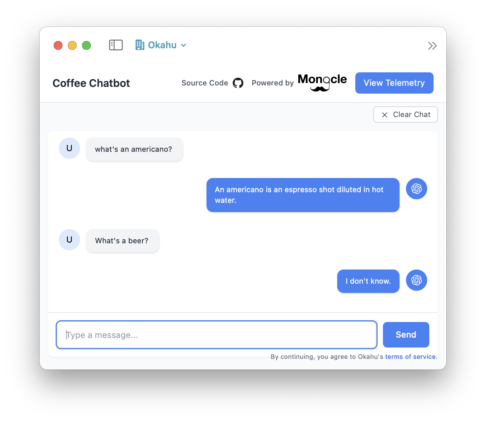
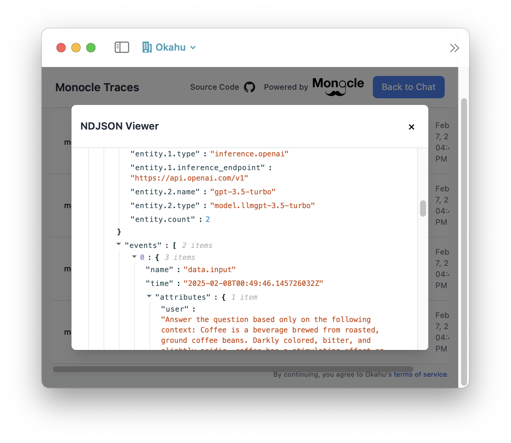
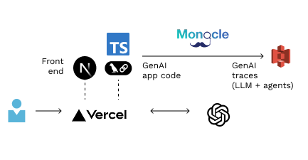

# Observing GenAI apps with open-source Monocle

This repository contains source code for an [AI assistant](#about-this-ai-assistant) that answers questions about coffee to demo how you can use open-source [Monocle](#about-monocle) to make observing and improving GenAI apps easy. 

 

[Ask a question](https://chatbot-coffee-vercel.vercel.app/) about coffee and this AI assistant will answer based on [knowledgebase](data/coffeeText.js) about coffee using an LLM. You can then explore telemetry to view the traces captured by Monocle resulting from this interaction. This repository contains code for the GenAI app you can deploy to learn how Monocle instrumentation works. 

### About Monocle 


[Monocle](http://monocle2ai.org/) is a GenAI-native community driven open source project created to simplify instrumentation of AI apps so app developers can built high impact, safe and reliable AI apps. 

Monocle is currently a [Sandbox](https://lfaidata.foundation/projects/monocle/) project in Linux Foundation AI & Data. In it's first iteration, Monocle helps app developers make GenAI apps observable without having to write last-mile monitoring code. 

### About this AI assistant



This AI assistant is a simple chatbot with the front-end built with Next.js and the GenAI code built with Langchain framework that relies on an OpenAI GPT model. The app is hosted in Vercel with the GenAI code running in an API with NextJS route.

The GenAI app code is instrumented with Monocle using one line of code to trace the entire conversation including inferences to OpenAI and vector searchs. Monocle is configured to send traces to S3 so you can explore the raw trace data, which is in an OpenTelemetry compatible format with a GenAI-native metamodel abstraction added to it to simplify analysis. 

We also have versions of this code built with other languages like Python, LLM or agentic frameworks like LlamaIndex and hosted on other clouds like AWS, Microsoft Azure or Google Cloud. Monocle works identically irrespective of how your GenAI app is coded or where it's hosted. 

## Play with this AI assistant

- Ask this AI assistant a question about coffee 
  - Open a [chat window](https://chatbot-coffee-vercel.vercel.app/)
- Check out the traces generated by Monocle 
  - Click on the [View Telemetry](https://chatbot-coffee-vercel.vercel.app/s3) button to see a list of trace files on S3. 
  - Click on a specific trace file to see the content in a modal view. 
    - You can expand or collapse sections of json. 

This demo is managed by the following LF contributors to Monocle: *Okahu*.[^1] 

### Explore the GenAI app code 

- Front end code in NextJS   
  - User enters message in [Chat window](src/app/page.tsx)  
  - Clicking send invokes GenAI code in [api/coffeechat](src/app/api/coffeechat/route.ts).
  - User switch to AWS S3 [trace browser](src/app/s3/page.tsx) to view Monocle traces. 

- GenAI code in Typescript with Langchain framework
  - Uses **a single RAG chain** specified in [coffeechat/langchain.ts](src/app/api/coffeechat/langchain.ts).
  - [Prompt template](src/app/api/coffeechat/utils.ts) includes user message as `{question}` and [data](data/coffeeText.js) about coffee as `{context}`. 
  - OpenAI `OpenAIEmbeddings` model is used to create embeddings stored in an in-memory vector store.
  - OpenAI `ChatOpenAI` model is used to respond to user. 

### To add Monocle instrumentation

- Add monocle2ai to [instrumentation.ts](src/instrumentation.ts) per NextJS [convention](https://nextjs.org/docs/app/api-reference/file-conventions/instrumentation)
  - `const { setupMonocle } = require("monocle2ai")` specifies use of the Monocle npm package
  - `setupMonocle("openai.app")` specifies tracing and metadata to add to traces

- Add package dependency and environment variables to configure where to send traces
  - Include `"monocle2ai": "^0.0.1-beta.2"` in [package.json](package.json)
  - See [.env](.env) for environment variables to specify where Monocle sends the traces
     - In this example the traces are sent to a bucket in AWS S3. 

## Deploy your own AI assistant

### Deploy this app as a project to Vercel 

// coming soon 

### Add your own data (optional)

To customize this AI assistant 
1. Add your coffee preparations to this [knowledgebase](data/coffeeText.js). 
2. Recreate embeddings per instructions below.
3. Redploy your app to pick up the new embeddings. 

#### Generate embeddings 

1. Install dependencies:
```bash
npm install
```

2. Set your OpenAI API key:
```bash
export OPENAI_API_KEY=<YOUR_OPENAI_API_KEY>
```

3. Run the embedding creator script:
```bash
node data/coffeeEmbeddingCreator.js
```

This script will read `data/coffeeText.js` to generate `coffeeEmbedding.json`, which is then used as `coffeeData` in [coffeechat/utils.ts](src/app/api/coffeechat/utils.ts) to create the `{context}` in the [system prompt](src/app/api/coffeechat/utils.ts). 


[^1]: Use of Okahu hosted demo is covered by Okahu's [terms of service for evaluations](https://www.okahu.ai/agreements/evaluation-agreement). 
  [Okahu](https://www.okahu.ai) is a team of AI, observability & cloud engineers working to simplify observability for agentic and other GenAI apps. We serve AI app developers, platform engineers and engineering leaders to build reliable, accurate and safer AI apps. We believe in community driven open source software and are a major contributor to GenAI native observability Project Monocle hosted by Linux Foundation.
  Connect with us on [Linkedin](https://www.linkedin.com/company/99272699/admin/dashboard/), [Github](https://github.com/okahu) or email us at <dx@okahu.ai>
